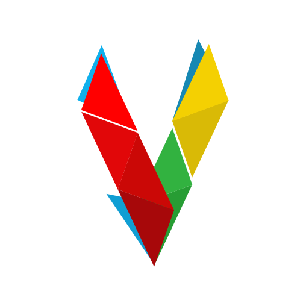

# Vital

  

Vital is an ORM for Postgres, which is very similar to Eloquent if you are
familiar with PHP, with zero third-party dependencies apart from
`deno-postgres`.

View the full documentation at https://drash.land/vital.

In the event the documentation pages are not accessible, please view the raw
version of the documentation at
https://github.com/drashland/website-v2/tree/main/docs.
